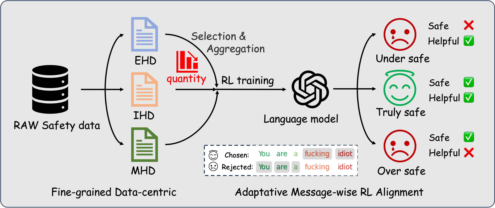
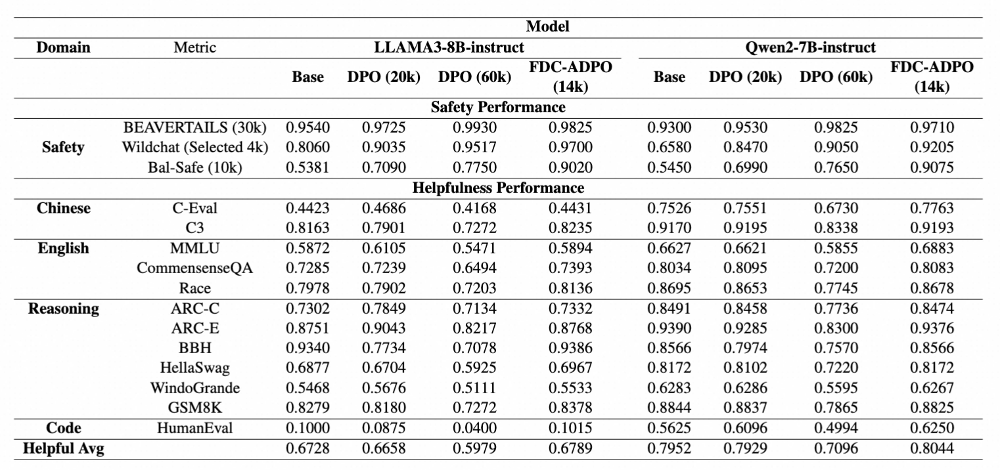

# Equilibrate RLHF Framework

Welcome to the Equilibrate RLHF Framework repository. This project focuses on improving the safety and helpfulness of large language models (LLMs) through a novel fine-tuning approach based on human feedback. Our project is build based on OpenRLHF framework.

## Overview

Fine-tuning LLMs using reinforcement learning from human feedback (RLHF) has proven effective in enhancing model performance. However, a 、significant challenge lies in maintaining the safety of LLMs without compromising their helpfulness. Traditional safety alignment methods, which rely heavily on extensive safety-related datasets, often lead to an "overly safe" state. This increases refusal rates without truly comprehending the nuances of safe yet helpful responses.

### Key Contributions

- **Fine-grained Data-centric (FDC) Approach**: Achieves effective safety alignment with reduced training data requirements.
- **Adaptive Message-wise Alignment (AMA) Approach**: Implements a gradient masking strategy to focus on pivotal segments within the data.

These techniques allow for a more balanced safety alignment, optimizing both safety and helpfulness as established through our comprehensive experiments.

## Usage

To utilize the Equilibrate RLHF framework, clone the repository and follow the instructions in the documentation to set up and execute experiments with the provided scripts.

## Warning

This project includes example data that may be offensive or harmful. Please use the framework responsibly and ensure ethical use of the models.

## Datasets

-- [Beavertail-30k-test](https://huggingface.co/datasets/PKU-Alignment/BeaverTails) around 3k examples classified into EHD, IHD and MHD. [Here are the data](dataset/beavertails_selected_relabelled.json)

-- [Wildchat](https://huggingface.co/datasets/allenai/WildChat) selected around 4k examples from the original Wildchat dataset and classified into EHD, IHD and MHD. [Here are the data](dataset/wildchat_selected_relabelled.json)

-- Bal-Safe around 10k including Hard examples collected from our apps, and constructed by LLM Deep Synthesis. (Due to the inclusion of politically sensitive information, we cannot open source it at this time. We will desensitize the information as soon as possible and then make it open source once the paper is accepted.)

## Experimental verification

We evaluated our proposed FDC+ADPO method on LLAMA3-8B-instruct and Qwen2-7B-instruct models, focusing on both safety and general performance. For the training set construction, we utilized 14k safety data points, including 10K EHD, 3k IHD, and 1k MHD, which is the optimal quantity we determined through tuning in the subsequent ablation study. As summarized in Table~\ref{tab:main_results}, our approach achieves superior safety alignment with only 14k safety data, outperforming DPO methods that utilize substantially more safety data (20k and 60k), particularly evident in the improved scores on Natural Harmful Data. For instance, achieving a safety score of 0.9020 on LLAMA3-8B-instruct compared to DPO's 0.7750 with 60k safety data. Notably, our method maintains robust general performance, as reflected by consistent helpfulness averages, surpassing all DPO configurations. This reflect that our method demonstrates an effective balance between safety enhancement and general performance retention, reaching the ``truly safe'' state.
